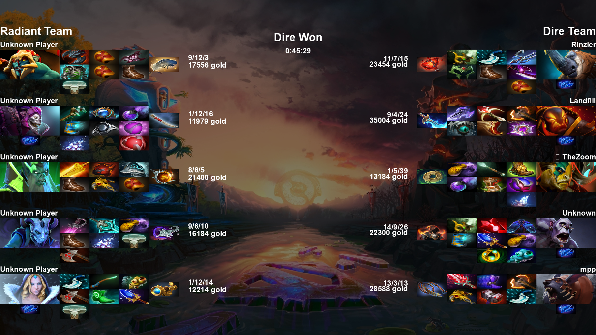

# Dota 2 Player Report
This application is intended to return back dota 2 game summaries from a set of steamids. These summaries will be sent to a dota 2 webhook based on the choice of the user. The games are selected by steamids provided by the user. Here is an example image as seen below:




## How to get started
There are two current ways to utilize this code, which I will describe. However be sure to add configuration for more information see the /config-example/ directory
### docker-compose
```
docker-compose up --build
```
and thats how simple it is!
### Running main.py and having a mysql database
```
docker run --name mysql -e MYSQL_ROOT_PASSWORD=password -d mysql:latest
python -u main.py
```
fairly simple too, but you got to run one more command :)

## Technologies Used
- MySQL
- Docker
- Docker-compose
- Python

## Database (MySQL)
The mysql database is used to collect the match data the database picks up, which is used for future analysis into games. The current set up is the following

Database is called dota2:
- match_players: holds data on the player during a particular match
- matches: holds data on the match
- players: player meta information
- items: item information
- heroes: hero information

## References
### Useful information in json for heros/items
https://raw.githubusercontent.com/odota/dotaconstants/master/build/items.json
https://raw.githubusercontent.com/odota/dotaconstants/master/build/heroes.json
### Endpoint to get item and hero images
http://cdn.dota2.com
### Useful Endpoint from dotabuff
https://github.com/dotabuff/d2vpkr


## Considerations and Thoughts
I opted to not use OpenDota's APIs, since it they have a rate limit of 2000 daily, compared to steam developers api, which is 100,000. With this in mind, the documentation for the these APIs are very sparce. I'll be detailing some issues I have encountered while working with these apis:
